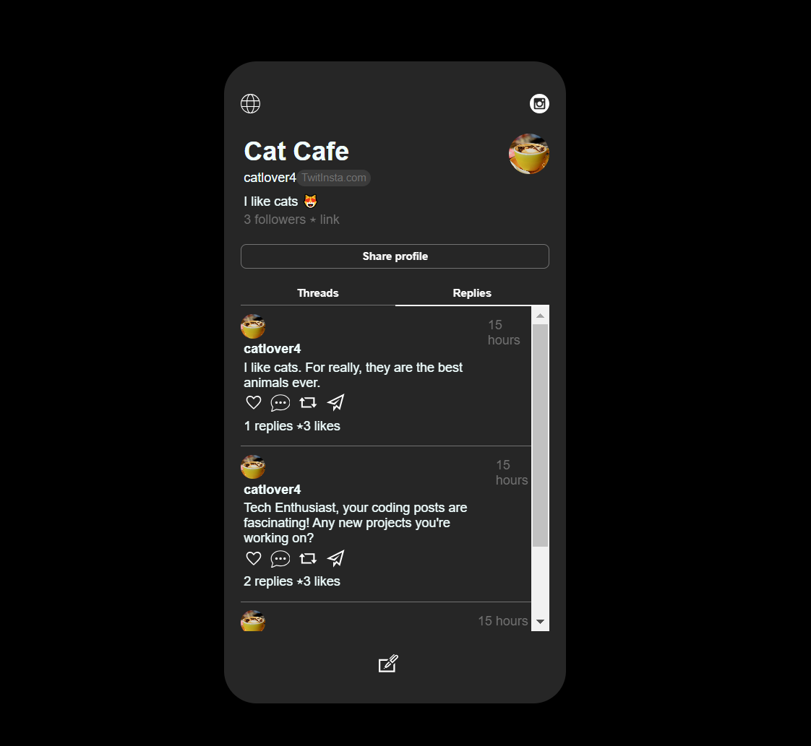

# Twit-Insta App

This application is a mock-up version of the popular social network. It is made in React and CSS. To emulate a back-end, I used [json-server](https://www.npmjs.com/package/json-server).

This project was bootstrapped with [Create React App](https://github.com/facebook/create-react-app).

### Run locally

Command to start the json-server: `npx json-server --watch db.json`. It will open in port 3000. 
Then open a new terminal and open the app with `npm start` . You will be prompt to ask the terminal at another location ( by default, port 3001).

About Moment package: complete library for proper date objects manipulation: https://www.npmjs.com/package/moment

### Acknowledgment

Original project idea : [Ania Kubow](linkedin.com/in/ania-kubow)

